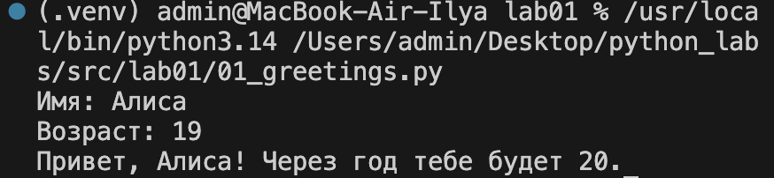
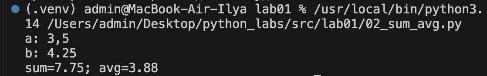
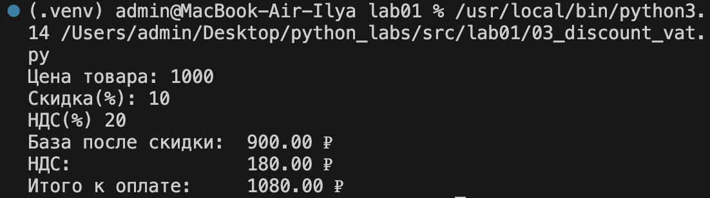
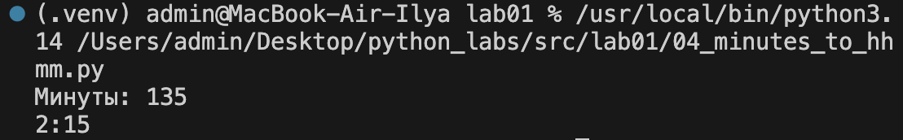
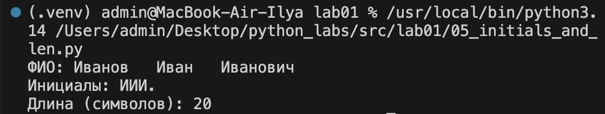
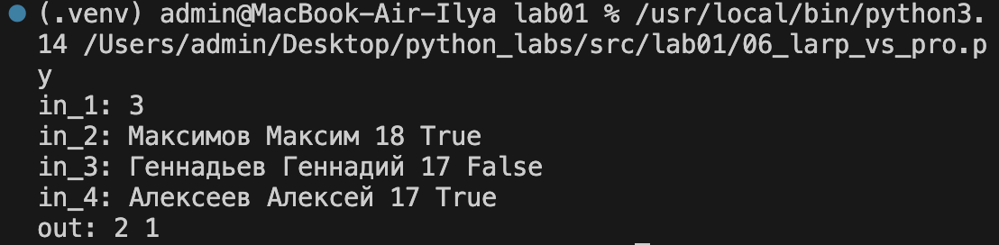
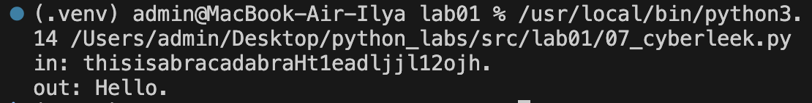

# Лабораторная работа №1

Ввод/вывод, форматирование строк, циклы и работа со строками на Python.

## Задание 1. Приветствие

Файл: [`01_greetings.py`](01_greetings.py)

Программа запрашивает имя и возраст пользователя, выводит приветствие и сообщает, сколько лет исполнится через год.

## Задание 2. Сумма и среднее

Файл: [`02_sum_avg.py`](02_sum_avg.py)

Программа считывает два числа (в том числе с запятой в качестве десятичного разделителя) и выводит их сумму и среднее значение.

## Задание 3. Скидка и НДС

Файл: [`03_discount_vat.py`](03_discount_vat.py)

Программа рассчитывает итоговую стоимость товара с учётом скидки и НДС.

## Задание 4. Минуты в формат ЧЧ:ММ

Файл: [`04_minutes_to_hhmm.py`](04_minutes_to_hhmm.py)

Программа переводит количество минут в формат «часы:минуты».

## Задание 5. Инициалы и длина ФИО

Файл: [`05_initials_and_len.py`](05_initials_and_len.py)

Программа выводит инициалы по введённому ФИО и подсчитывает длину строки в символах.

## Задание 6. LARP vs PRO

Файл: [`06_larp_vs_pro.py`](06_larp_vs_pro.py)

Программа считывает список первокурсников (фамилия, имя, возраст, флаг) и подсчитывает, сколько из них отмечены флагом `True`, а сколько — `False`.

## Задание 7. Cyberleek

Файл: [`07_cyberleek.py`](07_cyberleek.py)

Программа находит в строке первую заглавную букву и первую цифру, вычисляет шаг между ними и, начиная с позиции заглавной буквы, «вырезает» из строки символы с этим шагом.

